# Diagram UML — Sistem Bengkel "Botak Engine Speed"

Dokumentasi diagram untuk aplikasi bengkel motor (backend Express + Sequelize).
Semua diagram ditulis dengan **Mermaid**, jadi bisa langsung dilihat di GitHub,
GitLab, atau VS Code (extension *Markdown Preview Mermaid Support*).

**Legenda warna (activity & use case):**

| Warna | Arti |
|-------|------|
| Teal | Tamu / Member |
| Ungu | Admin |
| Abu | Sistem (proses internal / cron) |
| Kuning | Titik keputusan (decision) |
| Merah | Gagal / error |
| Hijau | Mulai / selesai |

Daftar isi:
1. [Use Case Diagram](#1-use-case-diagram)
2. [Activity Diagram](#2-activity-diagram)
3. [Sequence Diagram](#3-sequence-diagram)
4. [Entity Relationship Diagram (ERD)](#4-entity-relationship-diagram-erd)
5. [Class Diagram](#5-class-diagram)

---

## 1. Use Case Diagram

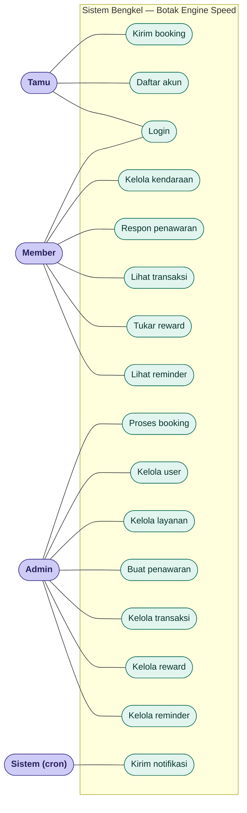
```mermaid
flowchart LR
  Tamu(["Tamu"]):::actor
  Member(["Member"]):::actor
  Admin(["Admin"]):::actor
  Sistem(["Sistem (cron)"]):::actor

  subgraph SB["Sistem Bengkel — Botak Engine Speed"]
    UC1(["Kirim booking"]):::uc
    UC2(["Daftar akun"]):::uc
    UC3(["Login"]):::uc
    UC4(["Kelola kendaraan"]):::uc
    UC5(["Respon penawaran"]):::uc
    UC6(["Lihat transaksi"]):::uc
    UC7(["Tukar reward"]):::uc
    UC8(["Lihat reminder"]):::uc
    UC9(["Proses booking"]):::uc
    UC10(["Kelola user"]):::uc
    UC11(["Kelola layanan"]):::uc
    UC12(["Buat penawaran"]):::uc
    UC13(["Kelola transaksi"]):::uc
    UC14(["Kelola reward"]):::uc
    UC15(["Kelola reminder"]):::uc
    UC16(["Kirim notifikasi"]):::uc
  end

  Tamu --- UC1
  Tamu --- UC2
  Tamu --- UC3
  Member --- UC3
  Member --- UC4
  Member --- UC5
  Member --- UC6
  Member --- UC7
  Member --- UC8
  Admin --- UC9
  Admin --- UC10
  Admin --- UC11
  Admin --- UC12
  Admin --- UC13
  Admin --- UC14
  Admin --- UC15
  Sistem --- UC16

  classDef actor fill:#CECBF6,stroke:#3C3489,color:#26215C,font-weight:bold
  classDef uc fill:#E1F5EE,stroke:#0F6E56,color:#04342C
```

> Catatan: `Member` mewarisi akses `Login` milik `Tamu`; setelah booking diproses
> admin, `Tamu` otomatis menjadi `Member`.

---

## 2. Activity Diagram

### 2.1 Booking → jadi Member & Transaksi

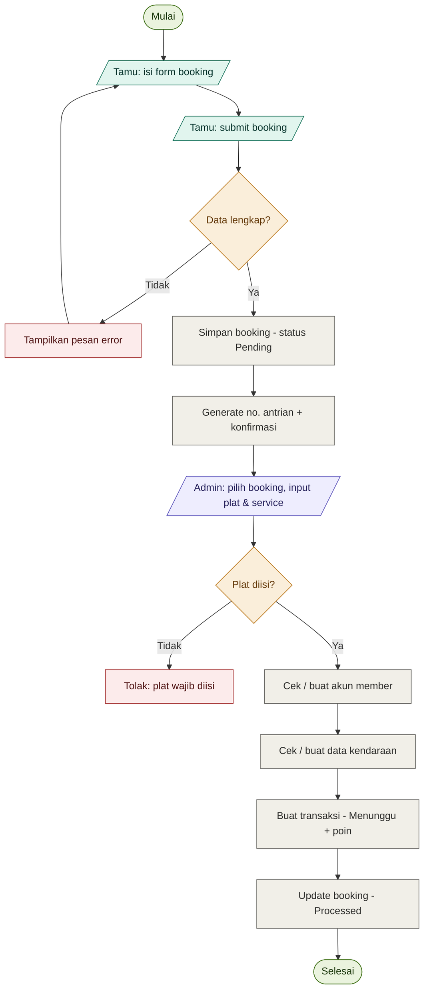
```mermaid
flowchart TD
  S([Mulai]):::se --> B1[/"Tamu: isi form booking"/]:::tamu
  B1 --> B2[/"Tamu: submit booking"/]:::tamu
  B2 --> D1{Data lengkap?}:::dec
  D1 -- Tidak --> E1["Tampilkan pesan error"]:::err
  E1 --> B1
  D1 -- Ya --> B3["Simpan booking - status Pending"]:::sis
  B3 --> B4["Generate no. antrian + konfirmasi"]:::sis
  B4 --> B5[/"Admin: pilih booking, input plat & service"/]:::adm
  B5 --> D2{Plat diisi?}:::dec
  D2 -- Tidak --> E2["Tolak: plat wajib diisi"]:::err
  D2 -- Ya --> B6["Cek / buat akun member"]:::sis
  B6 --> B7["Cek / buat data kendaraan"]:::sis
  B7 --> B8["Buat transaksi - Menunggu + poin"]:::sis
  B8 --> B9["Update booking - Processed"]:::sis
  B9 --> EN([Selesai]):::se

  classDef tamu fill:#E1F5EE,stroke:#0F6E56,color:#04342C
  classDef adm fill:#EEEDFE,stroke:#534AB7,color:#26215C
  classDef sis fill:#F1EFE8,stroke:#5F5E5A,color:#2C2C2A
  classDef dec fill:#FAEEDA,stroke:#BA7517,color:#633806
  classDef err fill:#FCEBEB,stroke:#A32D2D,color:#501313
  classDef se fill:#EAF3DE,stroke:#3B6D11,color:#173404
```

### 2.2 Autentikasi (Daftar & Login)

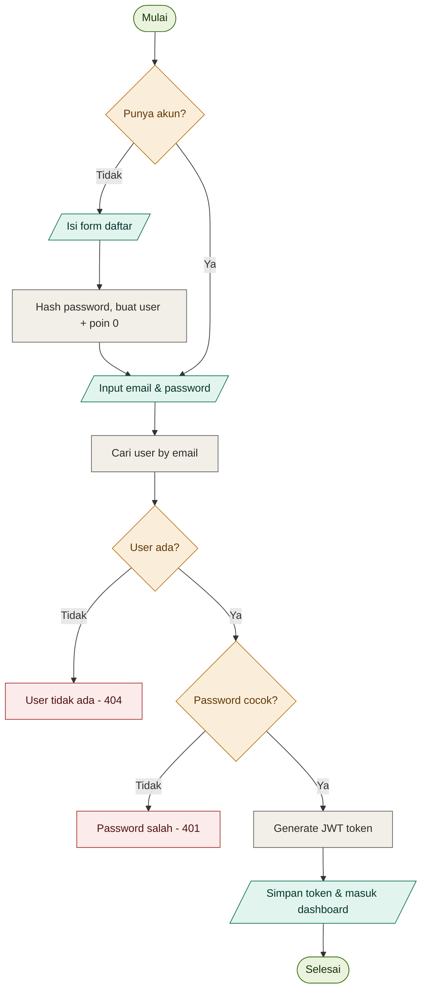
```mermaid
flowchart TD
  S([Mulai]):::se --> D0{Punya akun?}:::dec
  D0 -- Tidak --> R1[/"Isi form daftar"/]:::usr
  R1 --> R2["Hash password, buat user + poin 0"]:::sis
  R2 --> L1
  D0 -- Ya --> L1[/"Input email & password"/]:::usr
  L1 --> L2["Cari user by email"]:::sis
  L2 --> D1{User ada?}:::dec
  D1 -- Tidak --> E1["User tidak ada - 404"]:::err
  D1 -- Ya --> D2{Password cocok?}:::dec
  D2 -- Tidak --> E2["Password salah - 401"]:::err
  D2 -- Ya --> A1["Generate JWT token"]:::sis
  A1 --> A2[/"Simpan token & masuk dashboard"/]:::usr
  A2 --> EN([Selesai]):::se

  classDef usr fill:#E1F5EE,stroke:#0F6E56,color:#04342C
  classDef sis fill:#F1EFE8,stroke:#5F5E5A,color:#2C2C2A
  classDef dec fill:#FAEEDA,stroke:#BA7517,color:#633806
  classDef err fill:#FCEBEB,stroke:#A32D2D,color:#501313
  classDef se fill:#EAF3DE,stroke:#3B6D11,color:#173404
```

### 2.3 Penawaran (Proposal)

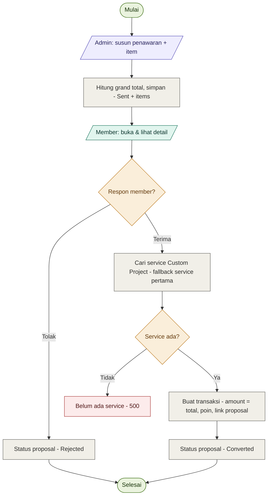
```mermaid
flowchart TD
  S([Mulai]):::se --> B1[/"Admin: susun penawaran + item"/]:::adm
  B1 --> B2["Hitung grand total, simpan - Sent + items"]:::sis
  B2 --> B3[/"Member: buka & lihat detail"/]:::mem
  B3 --> D1{Respon member?}:::dec
  D1 -- Tolak --> T1["Status proposal - Rejected"]:::sis
  T1 --> EN
  D1 -- Terima --> B4["Cari service Custom Project - fallback service pertama"]:::sis
  B4 --> D2{Service ada?}:::dec
  D2 -- Tidak --> E1["Belum ada service - 500"]:::err
  D2 -- Ya --> B5["Buat transaksi - amount = total, poin, link proposal"]:::sis
  B5 --> B6["Status proposal - Converted"]:::sis
  B6 --> EN([Selesai]):::se

  classDef adm fill:#EEEDFE,stroke:#534AB7,color:#26215C
  classDef mem fill:#E1F5EE,stroke:#0F6E56,color:#04342C
  classDef sis fill:#F1EFE8,stroke:#5F5E5A,color:#2C2C2A
  classDef dec fill:#FAEEDA,stroke:#BA7517,color:#633806
  classDef err fill:#FCEBEB,stroke:#A32D2D,color:#501313
  classDef se fill:#EAF3DE,stroke:#3B6D11,color:#173404
```

### 2.4 Tukar Reward

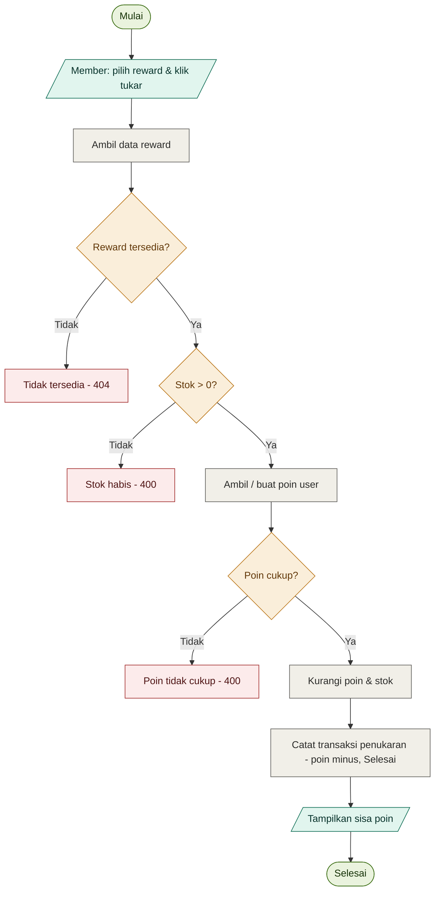
```mermaid
flowchart TD
  S([Mulai]):::se --> B1[/"Member: pilih reward & klik tukar"/]:::mem
  B1 --> B2["Ambil data reward"]:::sis
  B2 --> D1{Reward tersedia?}:::dec
  D1 -- Tidak --> E1["Tidak tersedia - 404"]:::err
  D1 -- Ya --> D2{"Stok > 0?"}:::dec
  D2 -- Tidak --> E2["Stok habis - 400"]:::err
  D2 -- Ya --> B3["Ambil / buat poin user"]:::sis
  B3 --> D3{Poin cukup?}:::dec
  D3 -- Tidak --> E3["Poin tidak cukup - 400"]:::err
  D3 -- Ya --> B4["Kurangi poin & stok"]:::sis
  B4 --> B5["Catat transaksi penukaran - poin minus, Selesai"]:::sis
  B5 --> B6[/"Tampilkan sisa poin"/]:::mem
  B6 --> EN([Selesai]):::se

  classDef mem fill:#E1F5EE,stroke:#0F6E56,color:#04342C
  classDef sis fill:#F1EFE8,stroke:#5F5E5A,color:#2C2C2A
  classDef dec fill:#FAEEDA,stroke:#BA7517,color:#633806
  classDef err fill:#FCEBEB,stroke:#A32D2D,color:#501313
  classDef se fill:#EAF3DE,stroke:#3B6D11,color:#173404
```

### 2.5 Update Status Transaksi (+ Poin Loyalty)

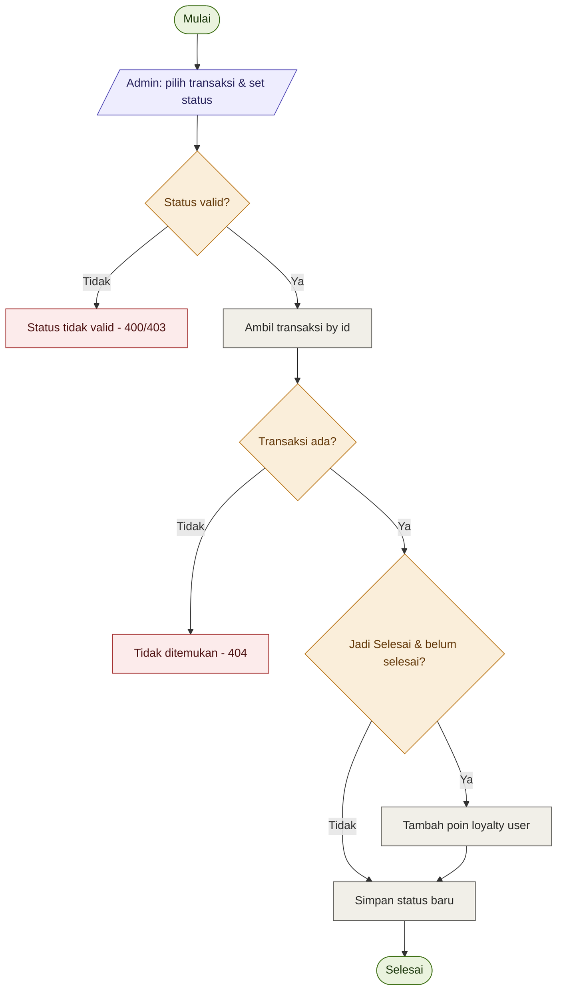
```mermaid
flowchart TD
  S([Mulai]):::se --> B1[/"Admin: pilih transaksi & set status"/]:::adm
  B1 --> D1{Status valid?}:::dec
  D1 -- Tidak --> E1["Status tidak valid - 400/403"]:::err
  D1 -- Ya --> B2["Ambil transaksi by id"]:::sis
  B2 --> D2{Transaksi ada?}:::dec
  D2 -- Tidak --> E2["Tidak ditemukan - 404"]:::err
  D2 -- Ya --> D3{"Jadi Selesai & belum selesai?"}:::dec
  D3 -- Ya --> B3["Tambah poin loyalty user"]:::sis
  D3 -- Tidak --> B4
  B3 --> B4["Simpan status baru"]:::sis
  B4 --> EN([Selesai]):::se

  classDef adm fill:#EEEDFE,stroke:#534AB7,color:#26215C
  classDef sis fill:#F1EFE8,stroke:#5F5E5A,color:#2C2C2A
  classDef dec fill:#FAEEDA,stroke:#BA7517,color:#633806
  classDef err fill:#FCEBEB,stroke:#A32D2D,color:#501313
  classDef se fill:#EAF3DE,stroke:#3B6D11,color:#173404
```

### 2.6 Reminder Servis Otomatis (Cron Job)

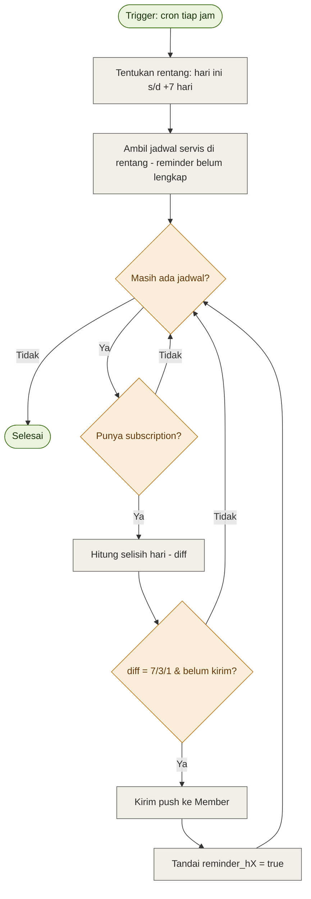
```mermaid
flowchart TD
  S(["Trigger: cron tiap jam"]):::se --> B1["Tentukan rentang: hari ini s/d +7 hari"]:::sis
  B1 --> B2["Ambil jadwal servis di rentang - reminder belum lengkap"]:::sis
  B2 --> D1{Masih ada jadwal?}:::dec
  D1 -- Tidak --> EN([Selesai]):::se
  D1 -- Ya --> D2{Punya subscription?}:::dec
  D2 -- Tidak --> D1
  D2 -- Ya --> B3["Hitung selisih hari - diff"]:::sis
  B3 --> D3{"diff = 7/3/1 & belum kirim?"}:::dec
  D3 -- Tidak --> D1
  D3 -- Ya --> B4["Kirim push ke Member"]:::sis
  B4 --> B5["Tandai reminder_hX = true"]:::sis
  B5 --> D1

  classDef sis fill:#F1EFE8,stroke:#5F5E5A,color:#2C2C2A
  classDef dec fill:#FAEEDA,stroke:#BA7517,color:#633806
  classDef se fill:#EAF3DE,stroke:#3B6D11,color:#173404
```

> Prasyarat: Member harus mengaktifkan notifikasi (`POST /push/subscribe`) lebih dulu;
> jika `pushSubscription` belum ada, jadwalnya dilewati.

### 2.7 CRUD Generik (Kelola Kendaraan / User / Layanan / Reward / Reminder)

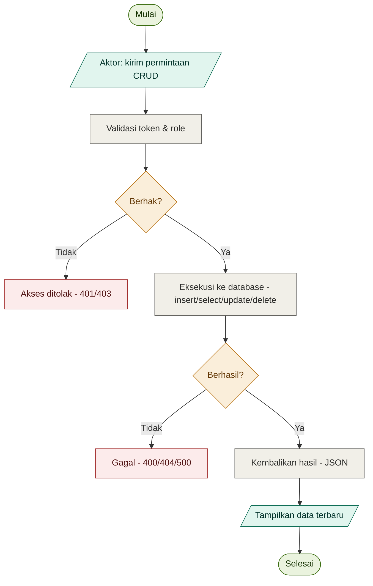
```mermaid
flowchart TD
  S([Mulai]):::se --> B1[/"Aktor: kirim permintaan CRUD"/]:::usr
  B1 --> B2["Validasi token & role"]:::sis
  B2 --> D1{Berhak?}:::dec
  D1 -- Tidak --> E1["Akses ditolak - 401/403"]:::err
  D1 -- Ya --> B3["Eksekusi ke database - insert/select/update/delete"]:::sis
  B3 --> D2{Berhasil?}:::dec
  D2 -- Tidak --> E2["Gagal - 400/404/500"]:::err
  D2 -- Ya --> B4["Kembalikan hasil - JSON"]:::sis
  B4 --> B5[/"Tampilkan data terbaru"/]:::usr
  B5 --> EN([Selesai]):::se

  classDef usr fill:#E1F5EE,stroke:#0F6E56,color:#04342C
  classDef sis fill:#F1EFE8,stroke:#5F5E5A,color:#2C2C2A
  classDef dec fill:#FAEEDA,stroke:#BA7517,color:#633806
  classDef err fill:#FCEBEB,stroke:#A32D2D,color:#501313
  classDef se fill:#EAF3DE,stroke:#3B6D11,color:#173404
```

---

## 3. Sequence Diagram

### 3.1 Booking → jadi Member & Transaksi

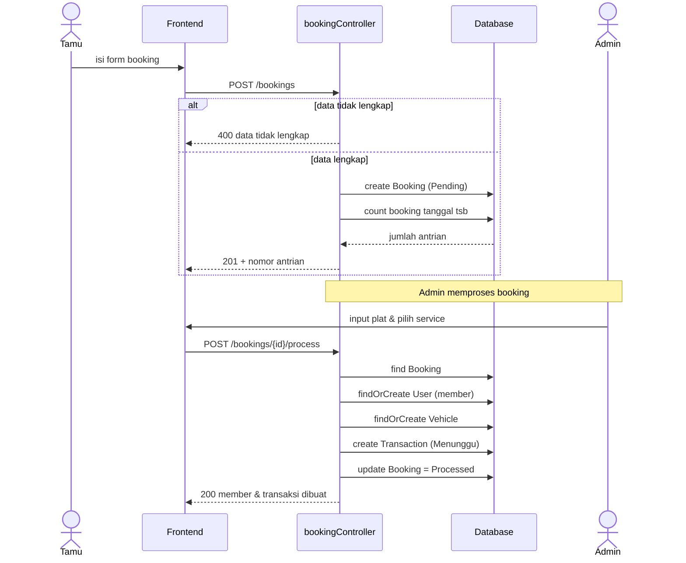
```mermaid
sequenceDiagram
  actor Tamu
  participant FE as Frontend
  participant API as bookingController
  participant DB as Database
  actor Admin
  Tamu->>FE: isi form booking
  FE->>API: POST /bookings
  alt data tidak lengkap
    API-->>FE: 400 data tidak lengkap
  else data lengkap
    API->>DB: create Booking (Pending)
    API->>DB: count booking tanggal tsb
    DB-->>API: jumlah antrian
    API-->>FE: 201 + nomor antrian
  end
  Note over Admin,API: Admin memproses booking
  Admin->>FE: input plat & pilih service
  FE->>API: POST /bookings/{id}/process
  API->>DB: find Booking
  API->>DB: findOrCreate User (member)
  API->>DB: findOrCreate Vehicle
  API->>DB: create Transaction (Menunggu)
  API->>DB: update Booking = Processed
  API-->>FE: 200 member & transaksi dibuat
```

### 3.2 Autentikasi (Daftar & Login)

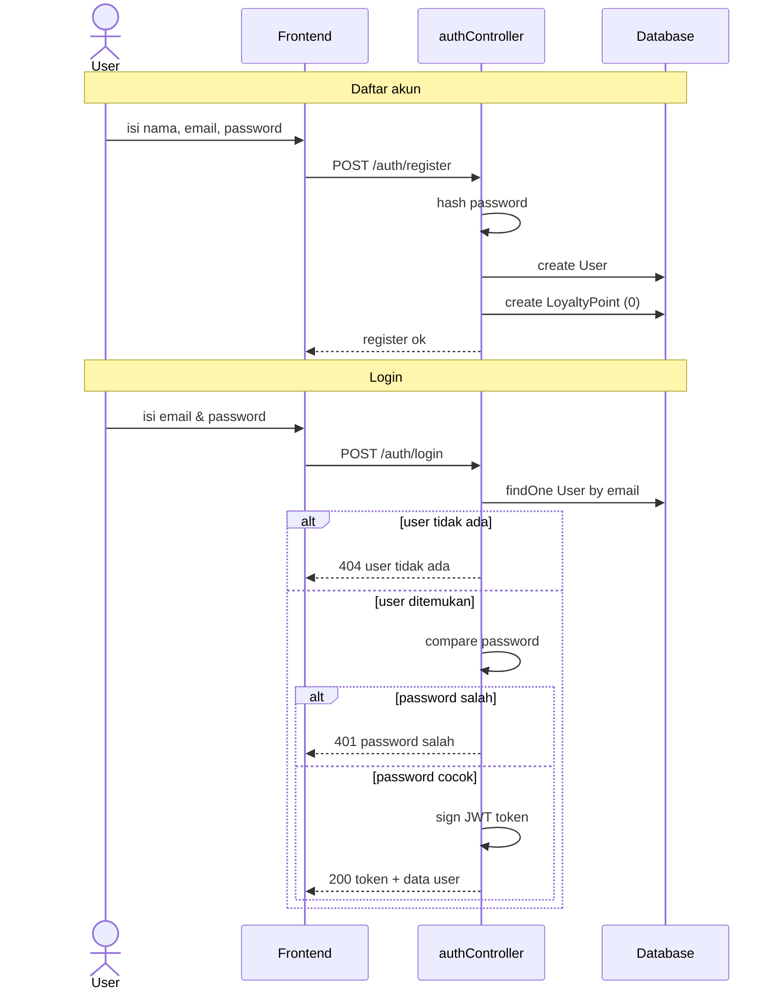
```mermaid
sequenceDiagram
  actor User
  participant FE as Frontend
  participant API as authController
  participant DB as Database
  Note over User,DB: Daftar akun
  User->>FE: isi nama, email, password
  FE->>API: POST /auth/register
  API->>API: hash password
  API->>DB: create User
  API->>DB: create LoyaltyPoint (0)
  API-->>FE: register ok
  Note over User,DB: Login
  User->>FE: isi email & password
  FE->>API: POST /auth/login
  API->>DB: findOne User by email
  alt user tidak ada
    API-->>FE: 404 user tidak ada
  else user ditemukan
    API->>API: compare password
    alt password salah
      API-->>FE: 401 password salah
    else password cocok
      API->>API: sign JWT token
      API-->>FE: 200 token + data user
    end
  end
```

### 3.3 Penawaran (Proposal)

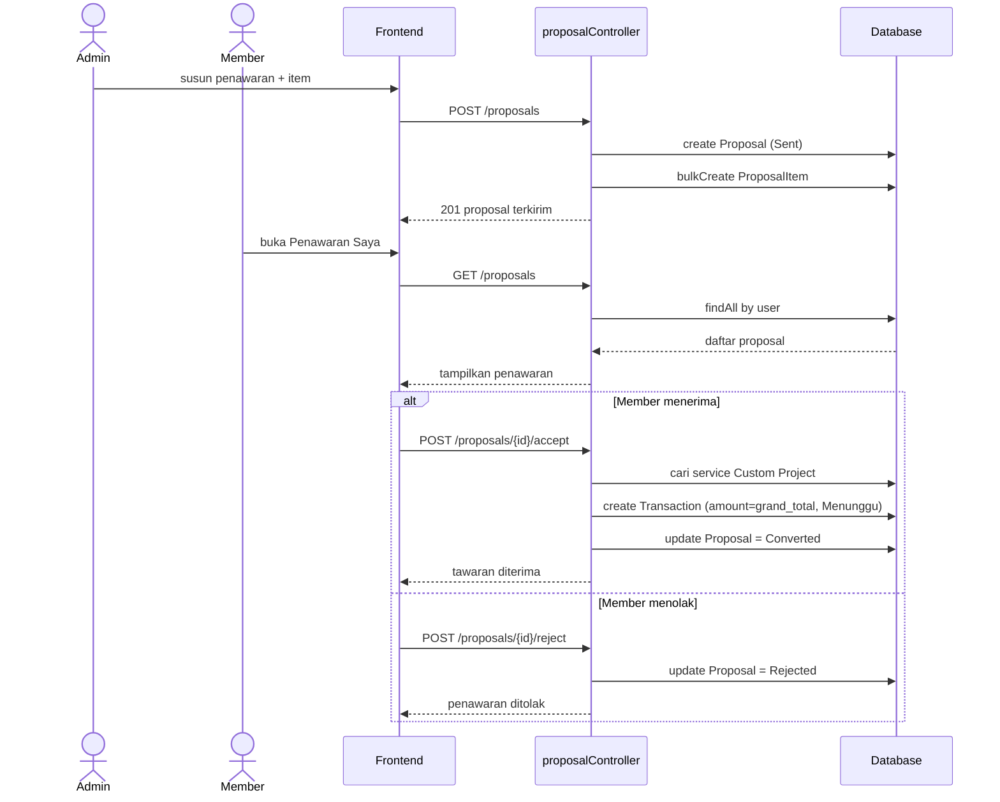
```mermaid
sequenceDiagram
  actor Admin
  actor Member
  participant FE as Frontend
  participant API as proposalController
  participant DB as Database
  Admin->>FE: susun penawaran + item
  FE->>API: POST /proposals
  API->>DB: create Proposal (Sent)
  API->>DB: bulkCreate ProposalItem
  API-->>FE: 201 proposal terkirim
  Member->>FE: buka Penawaran Saya
  FE->>API: GET /proposals
  API->>DB: findAll by user
  DB-->>API: daftar proposal
  API-->>FE: tampilkan penawaran
  alt Member menerima
    FE->>API: POST /proposals/{id}/accept
    API->>DB: cari service Custom Project
    API->>DB: create Transaction (amount=grand_total, Menunggu)
    API->>DB: update Proposal = Converted
    API-->>FE: tawaran diterima
  else Member menolak
    FE->>API: POST /proposals/{id}/reject
    API->>DB: update Proposal = Rejected
    API-->>FE: penawaran ditolak
  end
```

### 3.4 Tukar Reward

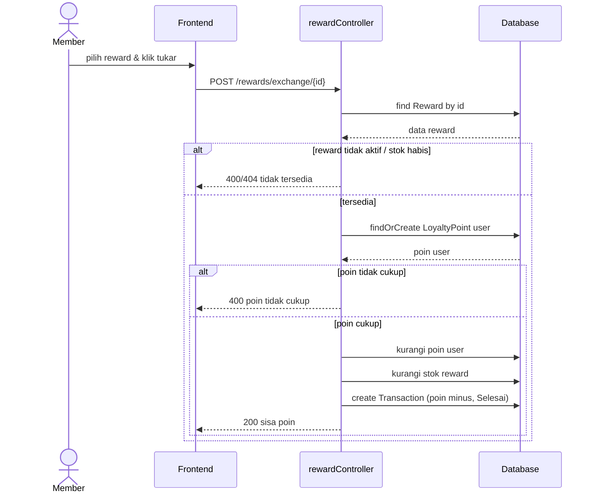
```mermaid
sequenceDiagram
  actor Member
  participant FE as Frontend
  participant API as rewardController
  participant DB as Database
  Member->>FE: pilih reward & klik tukar
  FE->>API: POST /rewards/exchange/{id}
  API->>DB: find Reward by id
  DB-->>API: data reward
  alt reward tidak aktif / stok habis
    API-->>FE: 400/404 tidak tersedia
  else tersedia
    API->>DB: findOrCreate LoyaltyPoint user
    DB-->>API: poin user
    alt poin tidak cukup
      API-->>FE: 400 poin tidak cukup
    else poin cukup
      API->>DB: kurangi poin user
      API->>DB: kurangi stok reward
      API->>DB: create Transaction (poin minus, Selesai)
      API-->>FE: 200 sisa poin
    end
  end
```

### 3.5 Update Status Transaksi

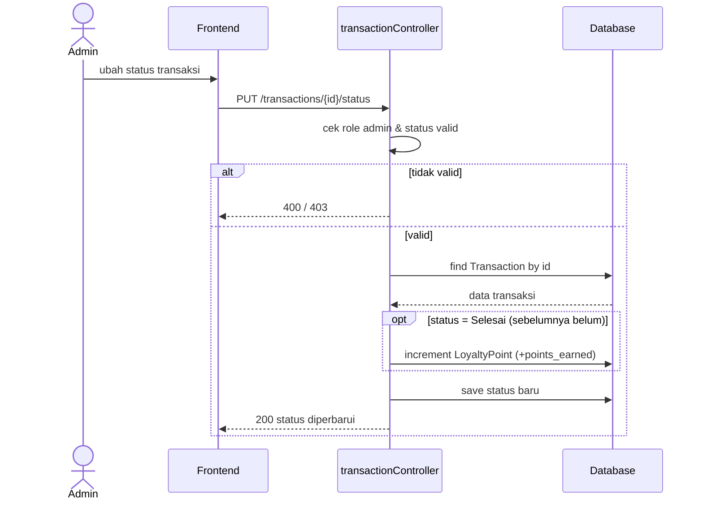
```mermaid
sequenceDiagram
  actor Admin
  participant FE as Frontend
  participant API as transactionController
  participant DB as Database
  Admin->>FE: ubah status transaksi
  FE->>API: PUT /transactions/{id}/status
  API->>API: cek role admin & status valid
  alt tidak valid
    API-->>FE: 400 / 403
  else valid
    API->>DB: find Transaction by id
    DB-->>API: data transaksi
    opt status = Selesai (sebelumnya belum)
      API->>DB: increment LoyaltyPoint (+points_earned)
    end
    API->>DB: save status baru
    API-->>FE: 200 status diperbarui
  end
```

### 3.6 Reminder Servis Otomatis

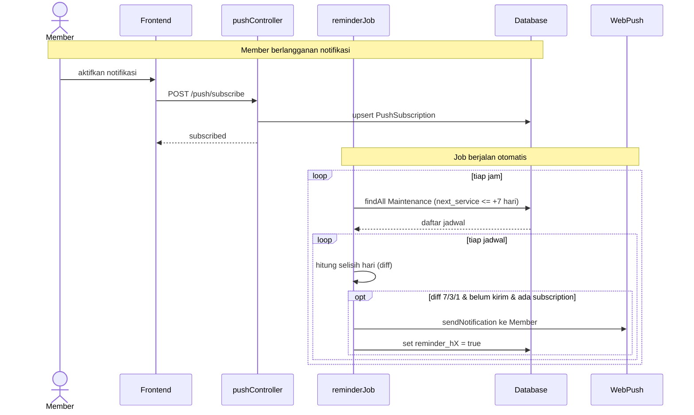
```mermaid
sequenceDiagram
  actor Member
  participant FE as Frontend
  participant PUSH as pushController
  participant CRON as reminderJob
  participant DB as Database
  participant WP as WebPush
  Note over Member,DB: Member berlangganan notifikasi
  Member->>FE: aktifkan notifikasi
  FE->>PUSH: POST /push/subscribe
  PUSH->>DB: upsert PushSubscription
  PUSH-->>FE: subscribed
  Note over CRON,WP: Job berjalan otomatis
  loop tiap jam
    CRON->>DB: findAll Maintenance (next_service <= +7 hari)
    DB-->>CRON: daftar jadwal
    loop tiap jadwal
      CRON->>CRON: hitung selisih hari (diff)
      opt diff 7/3/1 & belum kirim & ada subscription
        CRON->>WP: sendNotification ke Member
        CRON->>DB: set reminder_hX = true
      end
    end
  end
```

### 3.7 CRUD Generik

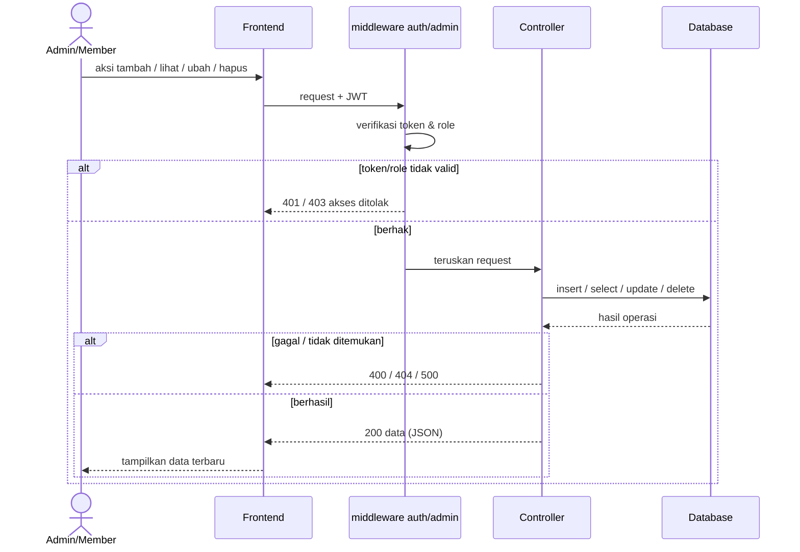
```mermaid
sequenceDiagram
  actor User as Admin/Member
  participant FE as Frontend
  participant MW as middleware auth/admin
  participant API as Controller
  participant DB as Database
  User->>FE: aksi tambah / lihat / ubah / hapus
  FE->>MW: request + JWT
  MW->>MW: verifikasi token & role
  alt token/role tidak valid
    MW-->>FE: 401 / 403 akses ditolak
  else berhak
    MW->>API: teruskan request
    API->>DB: insert / select / update / delete
    DB-->>API: hasil operasi
    alt gagal / tidak ditemukan
      API-->>FE: 400 / 404 / 500
    else berhasil
      API-->>FE: 200 data (JSON)
      FE-->>User: tampilkan data terbaru
    end
  end
```

---

## 4. Entity Relationship Diagram (ERD)

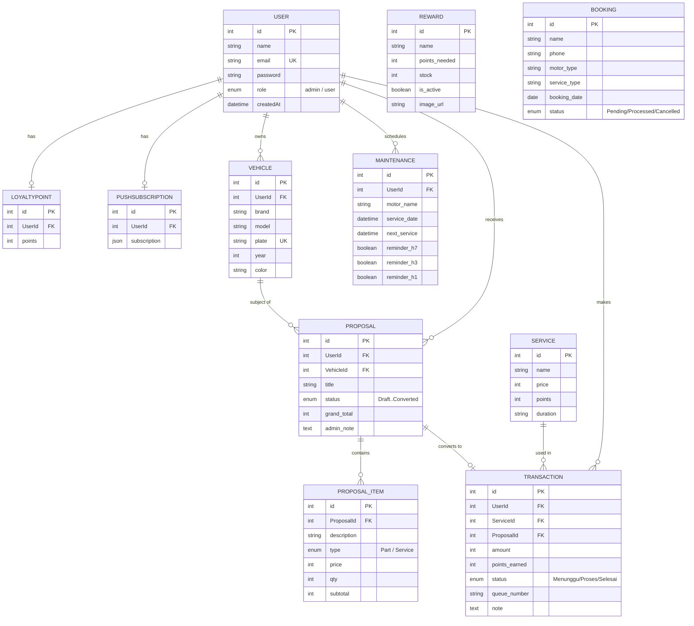
```mermaid
erDiagram
  USER ||--o| LOYALTYPOINT : has
  USER ||--o| PUSHSUBSCRIPTION : has
  USER ||--o{ VEHICLE : owns
  USER ||--o{ TRANSACTION : makes
  USER ||--o{ PROPOSAL : receives
  USER ||--o{ MAINTENANCE : schedules
  VEHICLE ||--o{ PROPOSAL : "subject of"
  SERVICE ||--o{ TRANSACTION : "used in"
  PROPOSAL ||--o{ PROPOSAL_ITEM : contains
  PROPOSAL ||--o| TRANSACTION : "converts to"

  USER {
    int id PK
    string name
    string email UK
    string password
    enum role "admin / user"
    datetime createdAt
  }
  LOYALTYPOINT {
    int id PK
    int UserId FK
    int points
  }
  PUSHSUBSCRIPTION {
    int id PK
    int UserId FK
    json subscription
  }
  VEHICLE {
    int id PK
    int UserId FK
    string brand
    string model
    string plate UK
    int year
    string color
  }
  SERVICE {
    int id PK
    string name
    int price
    int points
    string duration
  }
  TRANSACTION {
    int id PK
    int UserId FK
    int ServiceId FK
    int ProposalId FK
    int amount
    int points_earned
    enum status "Menunggu/Proses/Selesai"
    string queue_number
    text note
  }
  PROPOSAL {
    int id PK
    int UserId FK
    int VehicleId FK
    string title
    enum status "Draft..Converted"
    int grand_total
    text admin_note
  }
  PROPOSAL_ITEM {
    int id PK
    int ProposalId FK
    string description
    enum type "Part / Service"
    int price
    int qty
    int subtotal
  }
  MAINTENANCE {
    int id PK
    int UserId FK
    string motor_name
    datetime service_date
    datetime next_service
    boolean reminder_h7
    boolean reminder_h3
    boolean reminder_h1
  }
  REWARD {
    int id PK
    string name
    int points_needed
    int stock
    boolean is_active
    string image_url
  }
  BOOKING {
    int id PK
    string name
    string phone
    string motor_type
    string service_type
    date booking_date
    enum status "Pending/Processed/Cancelled"
  }
```

> Tabel `BOOKING` dan `REWARD` tidak punya foreign key (berdiri sendiri).
> Booking publik baru "dikonversi" menjadi `USER` + `VEHICLE` + `TRANSACTION`
> saat diproses admin, dan penukaran reward dicatat lewat kolom `note` di
> `TRANSACTION`, bukan relasi FK.

---

## 5. Class Diagram

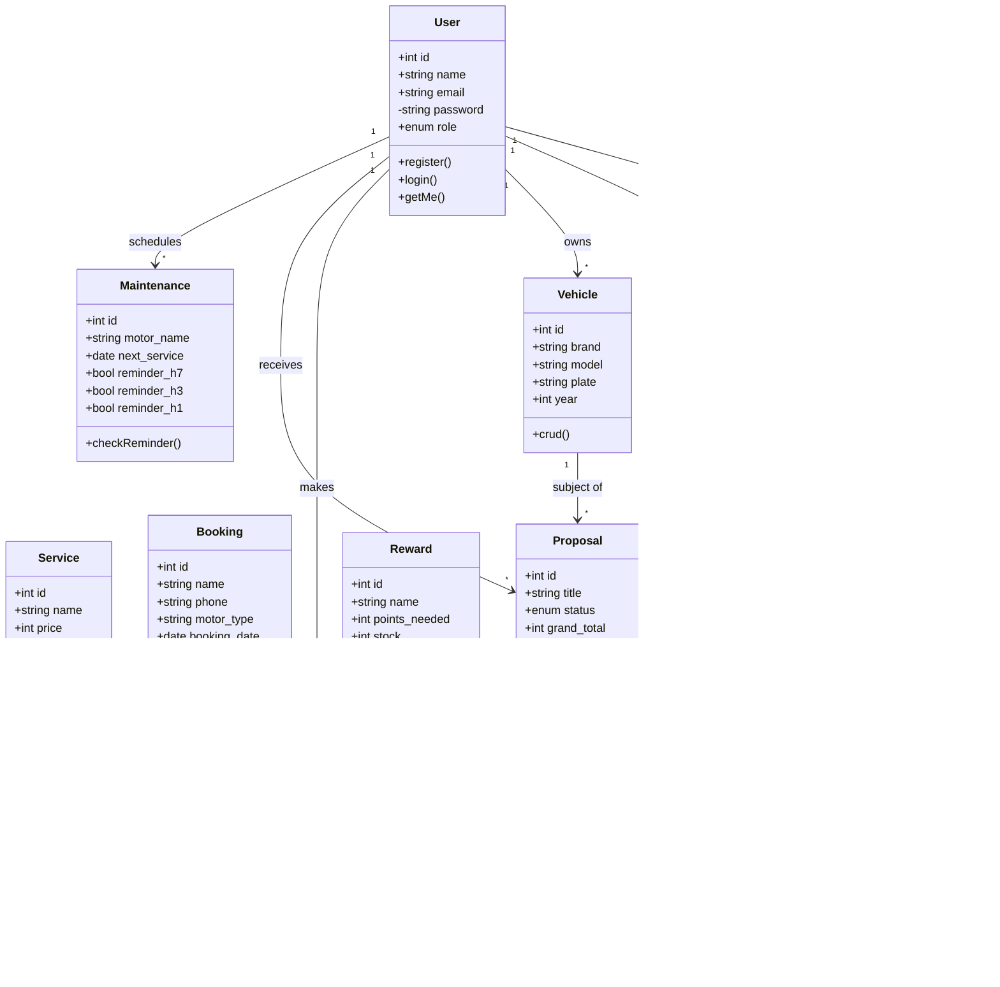
```mermaid
classDiagram
  class User {
    +int id
    +string name
    +string email
    -string password
    +enum role
    +register()
    +login()
    +getMe()
  }
  class LoyaltyPoint {
    +int id
    +int points
    +addPoints()
  }
  class PushSubscription {
    +int id
    +json subscription
    +subscribe()
  }
  class Vehicle {
    +int id
    +string brand
    +string model
    +string plate
    +int year
    +crud()
  }
  class Service {
    +int id
    +string name
    +int price
    +int points
    +crud()
  }
  class Booking {
    +int id
    +string name
    +string phone
    +string motor_type
    +date booking_date
    +enum status
    +create()
    +process()
  }
  class Transaction {
    +int id
    +int amount
    +int points_earned
    +enum status
    +string queue_number
    +create()
    +updateStatus()
  }
  class Proposal {
    +int id
    +string title
    +enum status
    +int grand_total
    +create()
    +accept()
    +reject()
  }
  class ProposalItem {
    +int id
    +string description
    +enum type
    +int price
    +int qty
    +int subtotal
  }
  class Reward {
    +int id
    +string name
    +int points_needed
    +int stock
    +bool is_active
    +exchange()
  }
  class Maintenance {
    +int id
    +string motor_name
    +date next_service
    +bool reminder_h7
    +bool reminder_h3
    +bool reminder_h1
    +checkReminder()
  }

  User "1" --> "0..1" LoyaltyPoint : has
  User "1" --> "0..1" PushSubscription : has
  User "1" --> "*" Vehicle : owns
  User "1" --> "*" Transaction : makes
  User "1" --> "*" Proposal : receives
  User "1" --> "*" Maintenance : schedules
  Vehicle "1" --> "*" Proposal : subject of
  Service "1" --> "*" Transaction : used in
  Proposal "1" *-- "*" ProposalItem : items
  Proposal "1" --> "0..1" Transaction : converts
  Booking ..> Transaction : process()
  Reward ..> Transaction : exchange()
```
